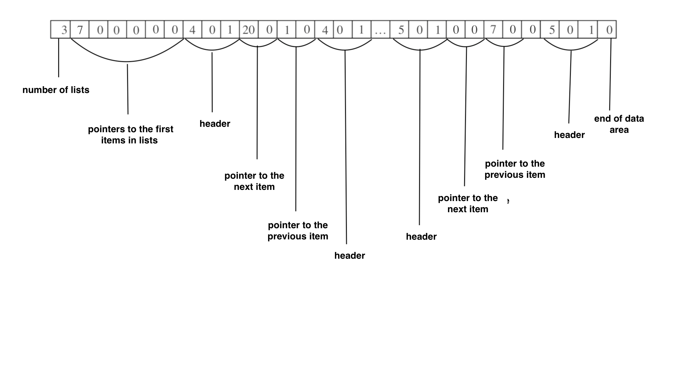
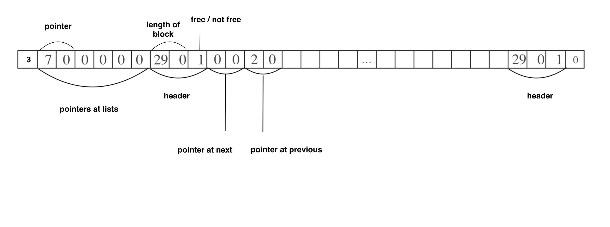

# About

This project is a result of the course Data Structures and Algorithms (WS 2019/2020). The aim is to get familiar with data managment. In my project, I have implemented the method of explicit lists with using lists of free blocks by their sizes.

<br>

# Data Managment 

There are four main functions:
1. ```memory_init(void *ptr, unsigned int size)``` - this one sets an area of data to be managed. Also it creates a list of pointers to the first item in each list of data blocks
2. ```memory_alloc(unsigned int size)``` - alocates, if it is possible, a data block within the area of data to be managed and returns pointer to it. In this function we traverse through the appropriate list of free data blocks.
3. ```memory_free(void *valid_ptr)``` - frees a block and adds to the list of free data blocks. Also it might concat this block with the previous free one in order to create a bigger one.
4. ```memory_check(void *ptr)``` - check the memory for consistency anf overlapping.

The data area:


The block:

